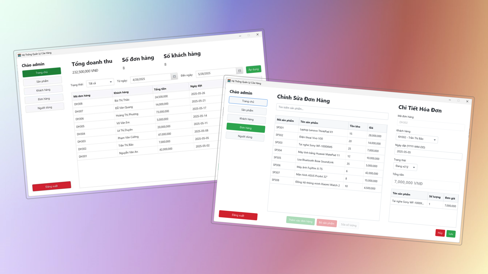

# QuanLyCuaHangFX
  
Ứng dụng quản lý cửa hàng bán lẻ đơn giản được xây dựng bằng **JavaFX** cho giao diện người dùng và **JDBC** để kết nối cơ sở dữ liệu **SQL Server**.

Dự án áp dụng mô hình kiến trúc **MVC** cùng với các pattern như **DAO** (Data Access Object) và **DTO** (Data Transfer Object) để đảm bảo mã nguồn rõ ràng, dễ bảo trì và dễ mở rộng.

Các chức năng chính bao gồm quản lý khách hàng, sản phẩm, đơn hàng, nhân viên và báo cáo doanh thu. Phù hợp cho mục đích học tập, làm đồ án hoặc phát triển các ứng dụng desktop quy mô nhỏ.

  
## Môi Trường

Dự án yêu cầu:
- Tải [JDK 21 hoặc mới hơn](https://jdk.java.net/) phù hợp với hệ điều hành.
> Đảm bảo rằng biến môi trường `JAVA_HOME` đã được thiết lập đúng đến thư mục cài đặt JDK.

- JavaFX 24: Lấy từ trang chính chủ chính [JavaFX](https://openjfx.io/).
- JDBC: Tải xuống từ đây [Microsoft JDBC Driver for SQL Server](https://learn.microsoft.com/vi-vn/sql/connect/jdbc/download-microsoft-jdbc-driver-for-sql-server?view=sql-server-ver16).

## Cài Đặt VÀ Chạy Trên VSCode

Thực hiện theo từng bước:

- Tải JavaFX và JDBC giải nén vào vị trí mong muốn.

- Đảm bảo đã cài đặt [Extension Pack for Java](https://marketplace.visualstudio.com/items?itemName=vscjava.vscode-java-pack) trong VSCode.

- Mở file `.vscode/settings.json`, thay thế `<JavaFX_lib_path>` bằng đường dẫn thư mục `lib` của JavaFX và JDBC trên máy bạn.

- Mở file `.vscode/launch.json`, thay thế `<JavaFX_lib_path>` bằng đường dẫn thư mục `lib` của JavaFX và JDBC trên máy bạn.

Sau khi đã thiết lập đầy đủ:

- Mở dự án trong VSCode.

- Nhấn `F5` hoặc chọn **Run > Start Debugging** để chạy ứng dụng.

> Giao diện chính sẽ xuất hiện nếu cấu hình JavaFX và JDBC đúng.

## Cấu Hình Cơ Sở Dữ Liệu
Ứng dụng sử dụng SQL Server làm hệ quản trị cơ sở dữ liệu.

- Sử dụng các câu lệnh SQL trong file `src/util/QLCH.sql` để tạo bảng và dữ liệu mẫu.

- Cập nhật thông tin kết nối trong file `db.properties` (user, password, tên máy chủ...).

## Cấu Trúc Thư Mục

Không gian làm việc mặc định chứa hai thư mục, trong đó:

- `src`: thư mục dùng để lưu trữ mã nguồn

Trong khi đó, các tệp kết quả biên dịch sẽ được tạo trong thư mục `bin` theo mặc định.

## Đóng Góp
Mọi đóng góp đều được hoan nghênh. Vui lòng fork dự án và gửi pull request. Bạn cũng có thể mở issue nếu phát hiện lỗi hoặc cần hỗ trợ thêm.
